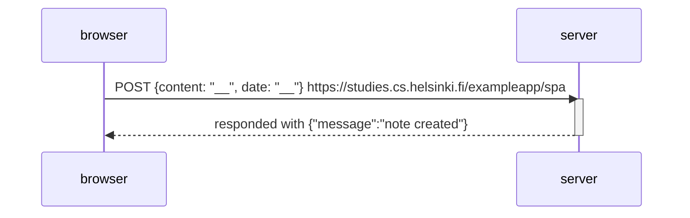

```mermaid
sequenceDiagram
    participant browser
    participant server

    browser->>server: POST {content: "__", date: "__"} https://studies.cs.helsinki.fi/exampleapp/spa
    activate server
    server-->>browser: responded with {"message":"note created"}
    deactivate server
```
